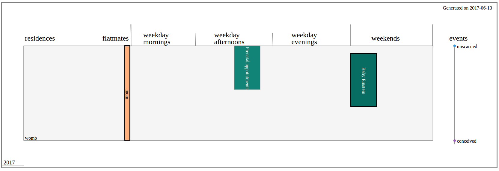

# Biograph

Inspired by [Rand McNally's histomap](https://www.slate.com/features/2013/08/histomapwider.jpg), biograph allows you to visualise and share a personal history.

Biographs are maps of a person's time and existence. Like other maps, they do not capture the full depth and story of the terrain. They are instead guides for a journey and an exercise in considering and documenting the most meaningful parts of that slice of the universe.

## Getting Started

You can build your biograph from a [tsv blueprint](sample-blueprints/alex.tsv) or from a [python blueprint](sample-blueprints/alex.py).

A user guide to writing a `blueprint.py` can be found [here](docs/user-guide.md).

A default `biograph.css` and `index.html` are provided for formatting. `personal.css` is available for those who wish to personalise the design of their biographs.

### Sample workflows

`./biograph.py -i blueprint.tsv -o timeline.svg` draws `timeline.svg` based on `blueprint.tsv`.

`./biograph.py -i blueprint.py -o timeline.svg` draws `timeline.svg` based on `blueprint.py`.

`./blueprint.py -t -o blueprint.tsv` writes a blueprint.tsv from a blueprint.py.

## Feedback

We, [the creators](https://github.com/devotees), hope you get as much satisfaction from building and sharing your biographs as we did.

If you would like help building yours, or have some grand ideas for improving the general feel and design, or want to feed our longing to hear the stories of friends and strangers, you can send a ping to [anjakefala](https://github.com/anjakefala) or [file an issue](https://github.com/devotees/biograph/issues).
